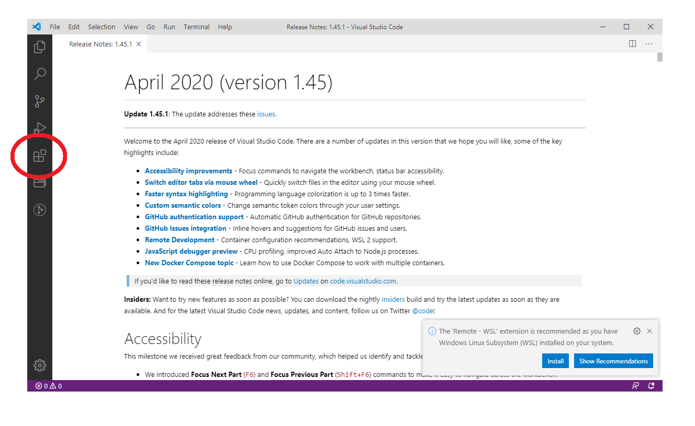

# テキストエディタのインストール

テキストエディタというのはただ文字を入力できてそれを保存するものです。  
いわゆるメモ帳です。  
ここで「あっワードか」となったかもしれませんが、  
MicrosoftのWordはワードプロセッサーといい、テキストエディタにはふつう含めません。  
プログラムを書く上で文字の色を変えたり、大きさを変えたり、余白を調整したりする機能のある文書作成ソフトは使いません。  
シンプルにただ文字列を文字列として保存できる物を使います。  

テキストエディタにも種類がいっぱいありますが、  
メモ帳でも一応可能ですが、それは通勤に三輪車を使うようなものです。  
ワードが自動車だとするとプログラムを書くのには不要なものが多すぎます。  
エンジンはついてなくていいので、自転車を使いましょう。  
例として
* [Terapad](https://tera-net.com/library/tpad.html) 無料 私もよく使う
* [秀まるエディタ](https://hide.maruo.co.jp/software/hidemaru.html)  有料 私は使ったことがない
* [サクラエディタ](https://sakura-editor.github.io) 無料 私は使ったことがない
* [Mery](https://www.haijin-boys.com/wiki/メインページ) 無料 私は使ったことがない
* [Sublime text](https://www.sublimetext.com/) 無料 そこそこ最近人気だった
* [Visual Studio Code](https://code.visualstudio.com) 無料 絶賛流行中
などを挙げておきます。  
ここでは最近流行りのVisual Studio Codeというテキストエディタをインストールします。  

もちろんテキストエディタが何なのか理解していて、お気に入り物がある場合それを使って構いません。  
私はVimをつかってこのテキストを書いています。Vimはいいぞ(/'ω')/

#### Visual Studio Code のインストール

インストール難しいところはないので雑に行きたいと思います

まず `2.soft/VSCodeSetup-x64-1.45.1.exe` を開きます。

ひらくとこのような画面になりますので、よくあるソフトと同じようにインストールできます。

この画面になったらチェックをすべて入れます。  
あとはそのまま進めるとインストールできます。  
インストールが完了するとVisual Studio Codeが起動します。  

左の赤まるをつけたアイコンをクリックします。

するとこのように左側にメニューが開きます。  
これはVisual Studio Codeに拡張機能を検索、インストールできるメニューです。  
上に検索窓がありますので検索してインストールできます。  
よく使うので覚えておきましょう。

