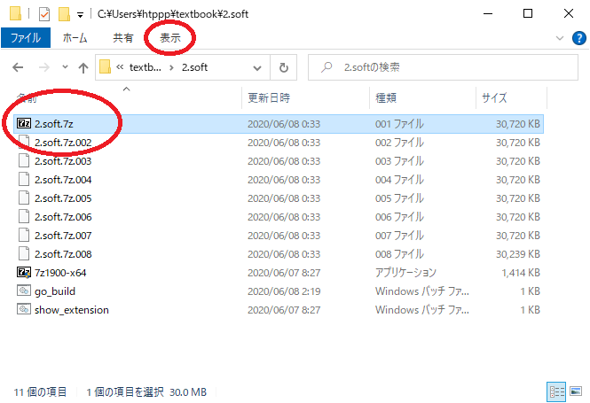
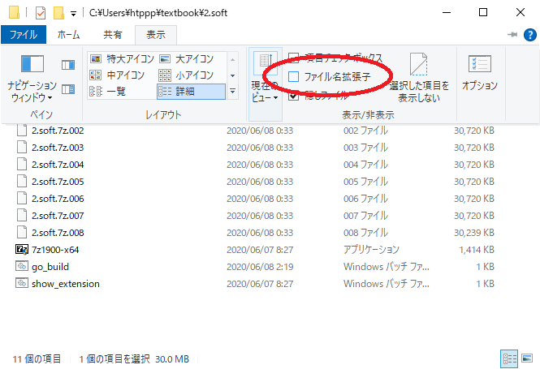
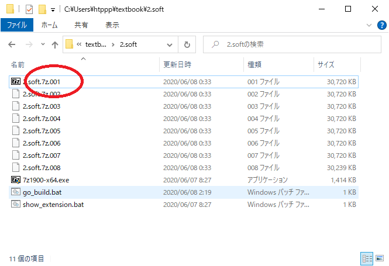

# 7zip

まず最初に7zipをインストールしてもらいたいです。  

<font color="red">7zip</font>は現在使われているソフトで、  
最高といっていい性能を持っている圧縮展開ファイル形式です。  
インストールすることでついてくるファイルビューワ`7ZipFM`も優秀なのでおすすめです。  
既にPCに別の圧縮展開ソフトが入っていても入れておきましょう。  

普段使っているものがあるからそれ使えばいいでしょと思われるかもしれませんが、  
`7zip`を強く推奨する理由があります。  
世間でよく使われているソフトにはプログラマー的に問題があるものがあるのです。  
Windows10の標準のものや`Lhaplus`のようなソフトは、  
ユーザーの安全重視してセキュリティの観点から、  
圧縮ファイルの中の勝手に大切なファイルを勝手に削除することがあるのです。  
プログラマーでないユーザーにはそれでよいでしょうけどもプログラマーにとってはとんだおせっかいです。  

問題がないほかの圧縮展開ソフトとして[WinRAR](https://www.winrarjapan.com/buy)を挙げておきます。  
シェアウェアという販売形態で、有料ソフトですが一応無料で使い続けることができます。  
私は買いました\_(:3 」∠ )\_

おせっかいのない素直に正しく動作するソフトを使いましょう。

## インストール

`2.soft`フォルダの中に`7z1900-x64.exe`があるのでこれを開いて`Install`をクリックします。  
これで7zipのインストールは終わりです。迷うことはないと思います。あとは閉じてよいです。


## 拡張子について

次に`2.soft`フォルダを見てください。  
このようなファイル構成になっているはずです。

```
2.soft/
├── 2.soft.7z.001
├── 2.soft.7z.002
├── 2.soft.7z.003
├── 2.soft.7z.004
├── 2.soft.7z.005
├── 2.soft.7z.006
├── 2.soft.7z.007
├── 2.soft.7z.008
├── 7z1900-x64.exe
├── go_build.bat
└── show_extension.bat
```

`2.soft.7z.001`から始まる連番のファイルがあります。  
ただ人によっては、`2.soft.7z`のように`001`がついて無いように見える場合があります。  

### 詳細表示  
  
### アイコン表示  
  

そうなっている方はエクスプローラーの上にある表示をクリックして、その中にある`ファイル名拡張子`にチェックをつけましょう。



これで`2.soft.7z.001`のように表示されると思います。




windowsにおいて名前にドット`.`が含まれるとき、最後のドット以降を<font color="red">拡張子</font>と呼びます。  
JPGやMP3を効いたことがあるかもしれません。だいたいそういうのです。  
`aaa.bbb.ccc.ddd`という名前のファイルがあったとしたら`.ddd`を拡張子といいます。  
普通ドットも含むことが多いです。  
拡張子はファイルの種類を判別するのに役立つため、表示するようにしましょう。  

どうしても設定できない場合のために`show_extension.bat`というものを置いています。
これをクリックして実行してください。
上のやり方とは違って、実行後に再起動が必要です。
面倒ではありますが、これで確実に拡張子が表示されるはずです。

## 7zipの使い方

拡張子が表示される状態にすると、001~008までファイルがあるのがわかると思います。  
001のファイルを右クリックして、出たメニューの中から7Zipにカーソルを合わせます。  
カーソルを合わせるとさらにメニューが出るので、  
とりあえずその中の「ここに展開」を選びます。別にどこに展開しても構わないです。  


これで

* [Git-2.27.0-64-bit.exe](https://gitforwindows.org/)
* [go1.14.4.windows-amd64.msi](https://golang.org/dl/)
* [python-3.8.3-amd64.exe](https://www.python.org/downloads/)
* [VSCodeSetup-x64-1.45.1.exe](https://code.visualstudio.com/download)

の４つのファイルが展開されます。


常に最新版がリリースされています。  
上の箇条書きには公式サイトへのリンクを張っていますので、  
最新版を取得して使って構いません。  
ただしバージョンアップによる変更で説明と実物が乖離します。  
新しいものを使って説明と乖離していた場合適当に選んでも問題ありません。  
パソコンというのはたいてい適当に操作しても、あとから取り返しがつくことが多いです。  
問題が起きたらその都度調べて解決しましょう。

