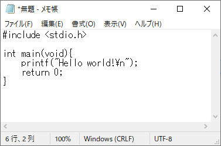
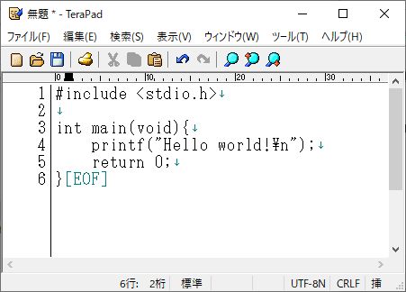
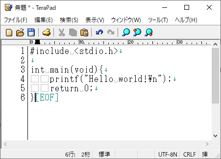
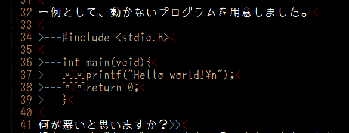
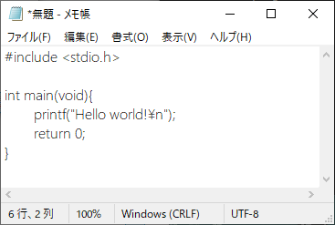
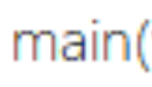
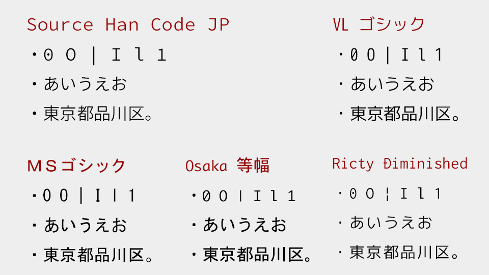
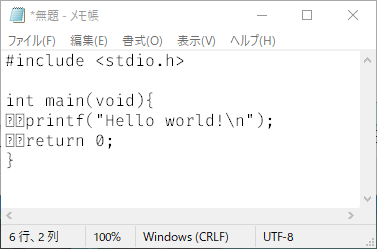
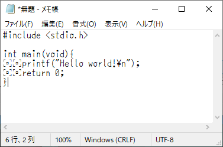

# フォントのインストール

これを読んでいるあなたがどれくらいフォントの重要性を認識しているかわかりませんが、  
フォントはプログラマーにはとても重要なものです。  
なぜならプログラムに1文字でも間違いがあってはならないからです。

例えば大文字のIと小文字のl、数字の1、記号の|など見た目が似ている文字があります。
他にも数字の0や大文字のOなど区別できないと困ります。
|でないと駄目なのにlが書いてあったなど、
プログラムが動かなくて間違っている部分を目を皿にして探さないといけなくなるかもしれないのです。

これは極端な例ですがマイナスに似た記号はこんなにあります。

| 文字 | UTF-8 | Unicode | 説明 |
| ---- | ---- | ---- | ---- |
| - | 2D | U+002D | ASCIIのハイフン |
| ー | E383BC | U+30FC | 全角の長音 |
| ‐ | E28090 | U+2010 | 別のハイフン |
| ‑ | E28091 | U+2011 | 改行しないハイフン |
| – | E28093 | U+2013 | ENダッシュ |
| — | E28094 | U+2014 | EMダッシュ |
| ― | E28095 | U+2015 | 全角のダッシュ |
| − | E28892 | U+2212 | 全角のマイナス |
| ｰ | EFBDB0 | U+FF70 | 半角カナの長音 |

他にシングルクォート' やバッククォート\` にも種類があります。  
「‘’」, 「“”」, 「‚‘」, 「„“」, 「‚’」, 「„”」, 「‹ ›」, 「« »」, 「› ‹」, 「» «」,

[https://ja.wikipedia.org/wiki/引用符](https://ja.wikipedia.org/wiki/引用符)

これらはウェブサイト等からソースコードをコピーした際に勝手に変換されていることがあります。

こういった文字がデザイン重視ですべて同じに見えてはダメなのです。  
プログラマーがコーディング(coding)に使う道具で、  
テキストエディターやフォントはこだわる必要があります。

一例として、動かないプログラムを用意しました。

	#include <stdio.h>

	int main(void){
	　　printf("Hello world!\n");
	　　return 0;
	}

何が悪いと思いますか？  
慣れるとすぐあれじゃないかなと思い当たるようになりますが、  
入門者には難しいでしょう。  

これをwindows標準のメモ帳で開くとこうなります。

特に変なところはありませんね。

これを先ほどインストールしたTerapadをあえて初期設定で使うとこうなります。

こちらも変なところはありませんね。  

それでは既に書いた設定を終えたTerapadで開くとこうなります。

どうでしょうか、ちょっと変わりましたね。
ちなみに私の使っているテキストエディタでこのテキストの部分はこのように表示されています。

こちらでも一目瞭然ですね。  
メモ帳や初期設定のTerapadではただの空白に見えるところが、  
設定済みのTerapadでは□が表示されています。  
これは何でしょうか。これは全角の空白です。  
プログラムにおいて全角空白は基本的に入っていてはダメです。  
プログラムが動かなくなります。  
これを知らずにプログラムを書いて動かない、  
原因がわからない、無駄に時間が過ぎる、自由な時間が浪費されてしまう、  
やる気がなくなる、と悪いことずくめなのです。

設定前のTerapadと設定後のTerapadでは、
実際は存在する文字なのだけども、何もないように表示される文字(不可視文字)の量がかわります。

設定済みのTerapadと私のテキストエディタの表示の違いは、フォントの違いです。
このフォントはプログラミング用のフォントの[ゆたぽん](http://net2.system.to/pc/font.html)というフォントです。
全角空白が強調されて表示される、区別がつきにくい文字をはっきり区別できる、などの特徴があるフォントです。

[http://anti.rosx.net/etc/memo/002_space.html](http://anti.rosx.net/etc/memo/002_space.html) には空白に見える様々な文字が載せてあります。
プログラマーが使ってよい空白は水平タブと半角空白の2つだけです。

プログラマーがプログラミングで使うフォントは選ばれたフォントでなければなりません。  
もう一つダメな例を載せます。

これは見た目きれいですが何がダメでしょうか。  
これはプロポーショナルフォントと呼ばれるフォントの1例です。  
1文字の幅が文字によって変わるフォントのことです。  
例えばiとmで数倍の差があります。  

プログラムは構造を持っています。  
プロポーショナルフォントはデザイン性のためにその構造をわかりずらくします。  
プログラマーが使うべきフォントは等幅フォントと呼ばれるフォントです。  
プログラムの制御構造を際立たせ、誤りを見つけやすくします。

テキストエディタやフォントで防げる誤りがあるのです。  

## フォントの条件

まとめると、

* 似た文字が区別できるフォントであること
* 空白(半角空白、全角空白、タブ)が区別できるよう可視化されるフォントであること
* 等幅フォントであること

こういった条件を満たすことが必要です。

こういった条件を普通のフォントは満たしていないので、特殊なフォントを使う必要があります。  
プログラミングする際はこういった条件を満たしているフォントを使いましょう。

[https://ics.media/entry/7010/](https://ics.media/entry/7010/)にありますが、
とりあえずSource Han Code JPを挙げておきます。
ただこのフォントは全角の文字幅が半角の1.5倍という変わったフォントではあります。

ほかのフォントとして白源を挙げておきます。
[https://github.com/yuru7/HackGen](https://github.com/yuru7/HackGen)

私はFira Codeも好きです。
[https://qiita.com/Nossa/items/457d17339e4d31cd0b0d](https://qiita.com/Nossa/items/457d17339e4d31cd0b0d)

私は先ほども言いましたがもう5年程ゆたぽんを使っています。
[http://net2.system.to/pc/font.html](http://net2.system.to/pc/font.html)

作者のREADME.TXTより

>	1. 半角英数字の可読性を重視する。
>	  （書体の統一感が損なわれても可読性を優先する）
>	  （[コンマ・ドット][セミコロン・コロン]
>	    [アイ・エル・いち][ゼロ・オー]）
>
>	2. 全角半角の区別も出来る様にする。
>	  （全角スペースは記号にする）
>
>	3. 平仮名、片仮名の濁音、半濁音の区別をはっきりさせる。
>	  （テン・まるを大きくする）
>
>	4. 漢字は、最低限入れる。
>	  （初期公開は、漢字無しでも可とする）（IBM拡張まで作成済み）
>
>	5. その他  
>	  半角と全角の括弧の区別が出来ます。
>	  漢数字「〇」と、丸印「○」の区別も付きます。

どのフォントでも構いませんので、専用のフォントを使うようにしましょう。

