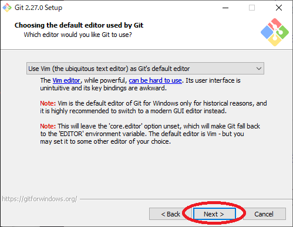
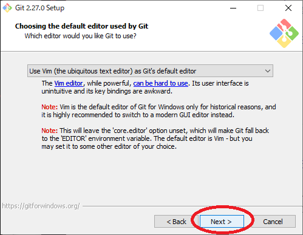
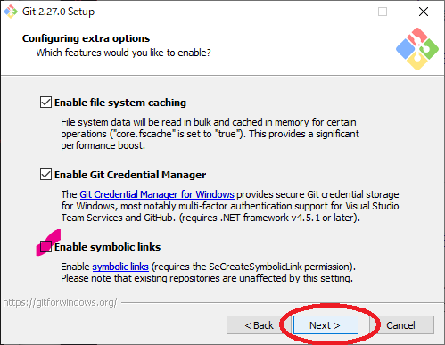

# Git

この中の`Git-2.27.0-64-bit.exe`を開いてください。
開けたら以下の画像の通りに進めていってください。
２か所だけ注意がありますが難しくないと思います。

  
  
  

ここの赤まるで囲った部分を画像に合わせてください。  

  
  
  
  
  
  
  
  

  

ここのEnable symbolic linksにチェックつけてください。  

  

以上でGitのインストールが終わりました。

