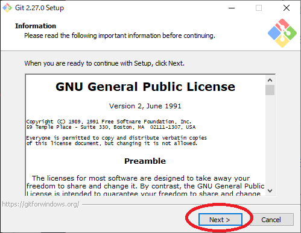
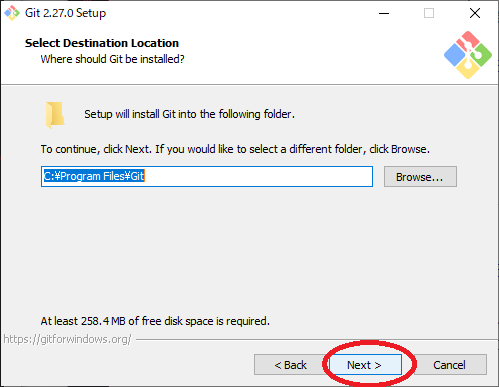
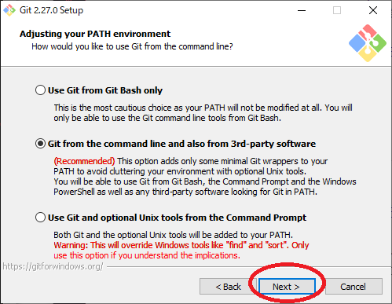

# Git

次にGitというソフトをインストールします。  
Gitは世界中で使われているバージョン管理ソフトというものです。  
雑に言うとファイルの履歴を残しておくことができる物です。  
現在ではほぼデファクトスタンダードとなっています。  
このテキストもGitで管理されています。

7Zipで展開したファイルの中にある`2.soft/Git-2.27.0-64-bit.exe`を開いてください。  
開けたら以下の画像の通りに進めてください。  
**２か所**だけ注意がありますが難しくないと思います。

  
次へ  

---

  
次へ  

---

  

上の画像の赤まるで囲った部分を画像に合わせてください。  

---

  
次へ  

---

  
次へ  

---

  
次へ  

---

  
次へ  

---

  
次へ  

---

  
次へ  

---

  
次へ  

---

  
次へ  

---

  

ここのEnable symbolic linksにチェックつけてください。  

---

  

以上でGitのインストールが終わりました。

