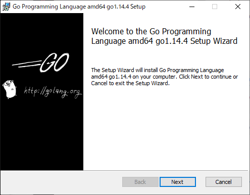

# Go言語のインストール

Googleが作ったGo言語(普通Golangという)を使えるようにします。

Go言語は比較的新しく2009年に作られました。
コンパイルが必要なコンパイル言語といわれる種類の言語です
いろんな言語のいいとこどりをした言語で、
覚えることが少ない特徴があり導入コストが低い言語です。
プログラミング入門にとても適している言語です。
詳しい説明は以降の章でします。

## インストール

まず、`2.soft/go1.14.4.windows-amd64.msi`を開きます。

特に難しいことはなく、適当に肯定的な選択肢を選んでいきます。
10秒くらいでインストールが完了します。

