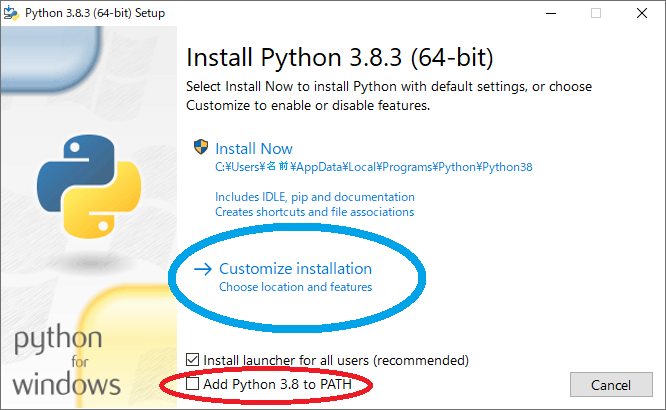
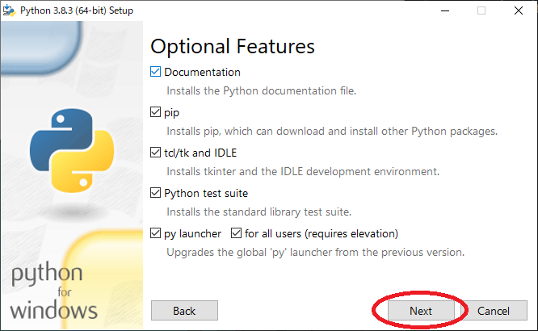
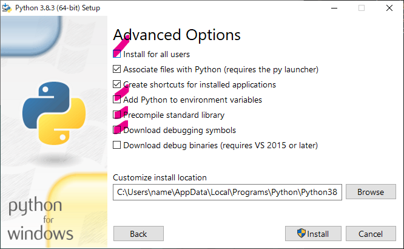
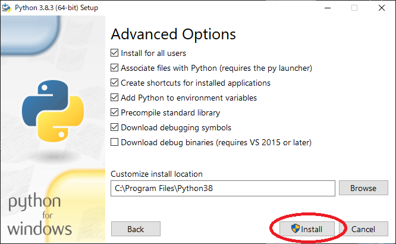

# Pythonのインストール

`forNoah/2.soft/python-3.8.3-amd64.exe` を開きます。

  

こういうのが出ますので、
赤い丸で囲った`Add Python 3.8 to PATH`にチェックを入れ、
青い丸で囲った`Customize installation`をクリックします

上のようになったら、この画像の通りになっているのを確認して、そのまま`Next`を押します。

下の画像の赤のところにようにチェックを入れます。

こうなります。

同じ状態になったら左下の`Install`をクリックします。

こんなふうになります。
私は1分くらいで終わりました。

インストール終わった感出ますがそのまま`Disable path length limit` をクリックします。

クリックすると消えますので左下の`Close`を押します。

これでPythonのインストール完了です。

