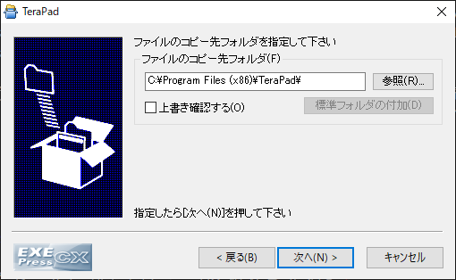
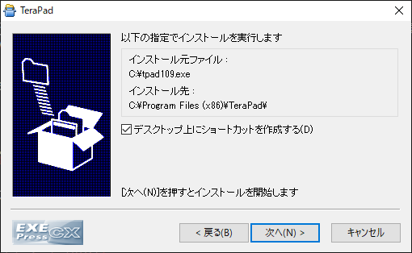
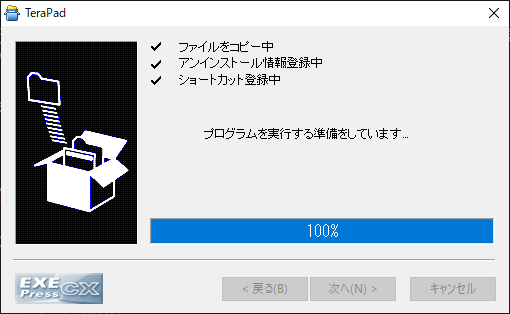
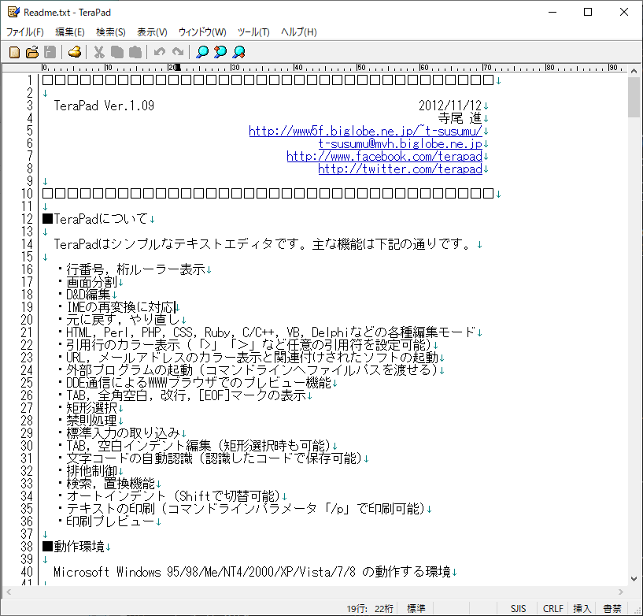
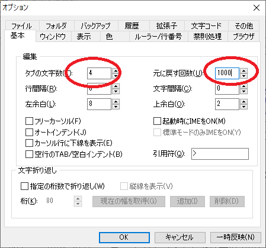
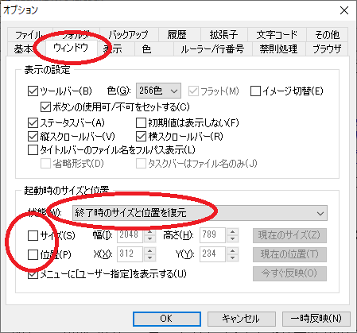
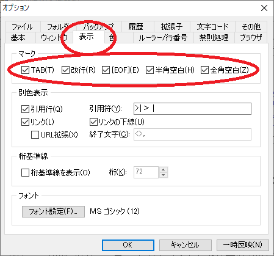
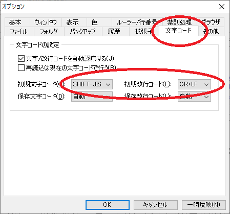
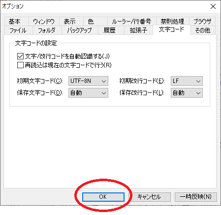

# Terapad のインストール

さてここからTerapadをインストールしていきます。
インストールに難しいところはありません。

まず`2.soft/tpad109.exe` を開きます。
あとは肯定的な選択肢をクリックして行けばインストールが終わります。

インストールが終わりますとTerapadが起動します。

ここで、Terapadの設定を変更します。
上の表示からオプションを選んでください。

開いたウィンドウのタブの文字数、元に戻す回数を画像のようにしてください。

次に上の沢山あるタブの中からウィンドウを選んでください。

下の機能の灰色のところを「終了時のサイズと位置を復元」に変更、  
下のサイズと位置のチェックを外してください。

終わったら上のタブの表示をクリックしてください。

上の1列すべてにチェックを入れてください。

終わったら上のタブの文字コードをクリックしてください。

このようになっていると思います。  
初期文字コードのところだけを弄ります。

まず右のCR+LFをLFに変更してください。

次に左の`SHIFT-JIS`を`UTF-8N`に変更してください。

間違いやすいのですが`UTF-8`ではなく`UTF-8N`です。`N`がついてるやつです。Nですよ。

この状態になればOKです。

