# テキストエディタのインストール

テキストエディタというのはただ文字を入力できてそれを保存するものです。いわゆるメモ帳です。  

ここで「あっワードか」となったかもしれませんが、トラックを乗用車に含めないようなもので、
MicrosoftのWordはワードプロセッサーと呼ばれ、普通テキストエディタには含めません。  
ワードはプログラムを書くのには不要なものが多すぎる上に、保存したものが独自形式で他で使えません。  

プログラムを書く上で文字の色を変えたり、大きさを変えたり、
余白を調整したりする機能のある文書作成ソフトは使いません。
シンプルにただ文字列を文字列として保存できる物を使います。  

テキストエディタにも種類がいっぱいあります。  
windows標準のメモ帳でも一応可能ですが、それは通勤に三輪車を使うようなものです。  
エンジンはついてなくていいので、自転車を使いましょう。  
例としていくつか挙げておきます。

名前                                                              | 値段 | コメント
---                                                               | ---  | ---
[Terapad](https://tera-net.com/library/tpad.html)                 | 無料 | 私もよく使う
[秀まるエディタ](https://hide.maruo.co.jp/software/hidemaru.html) | 有料 | 私は使ったことがない
[サクラエディタ](https://sakura-editor.github.io)                 | 無料 | 私は使ったことがない
[Mery](https://www.haijin-boys.com/wiki/メインページ)             | 無料 | 私は使ったことがない
[Sublime text](https://www.sublimetext.com/)                      | 無料 | そこそこ最近人気だった
[Visual Studio Code](https://code.visualstudio.com)               | 無料 | 絶賛流行中
[Vim](https://ja.wikipedia.org/wiki/Vim)                          | 無料 | 私がメインで使っている 慣れてからおすすめ

などを挙げておきます。  

ここではTerapadと最近流行りのVisual Studio Codeというテキストエディタをインストールします。  
2つインストールする理由はあなたに使いやすいほうを選んでもらいたいからです。  
Terapadはシンプルで、Visual Studio Codeは機能盛り沢山です。  
Terapadは個人の環境に左右されにくいので、このテキストではTerapadの画面を載せることが多いでしょう。  

もちろんテキストエディタが何なのか理解していて、お気に入り物がある場合それを使って構いません。  
私はVimをつかってこのテキストを書いています。Vimはいいぞ(/'ω')/

## Terapad のインストール

インストールに難しいところはありません。
`2.soft/tpad109.exe` を開きます。
あとは肯定的な選択肢をクリックして行けばインストールが終わります。

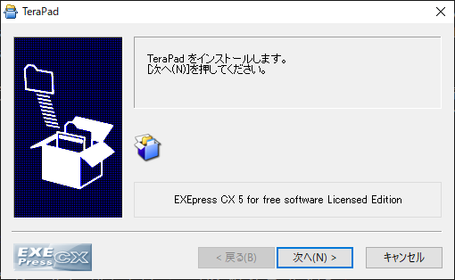
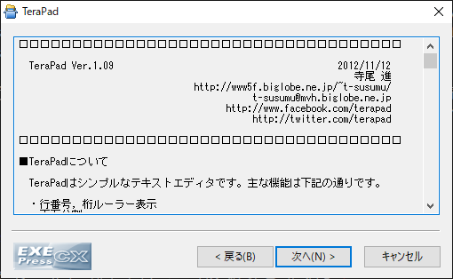
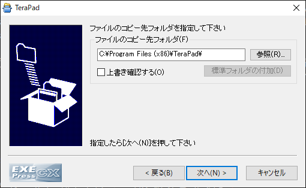
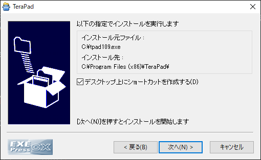
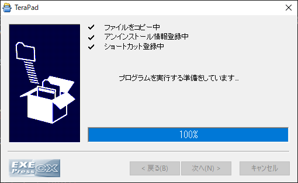

インストールが終わりますとTerapadが起動します。

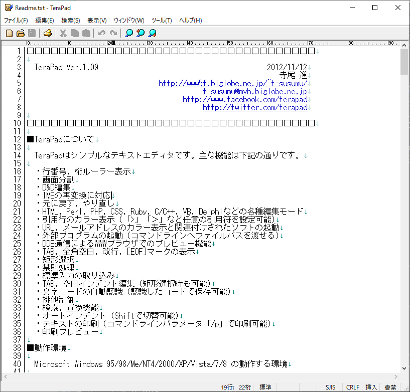

ここで、Terapadの設定を変更します。
上の表示からオプションを選んでください。

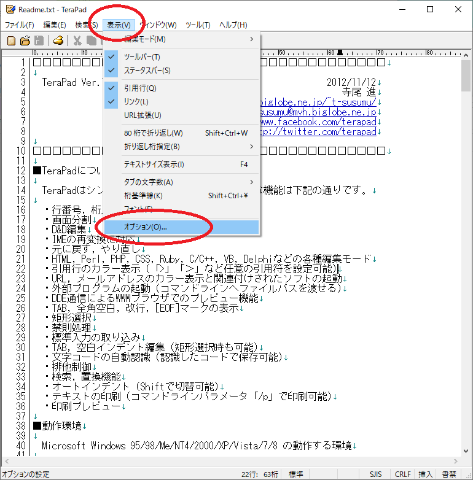

開いたウィンドウのタブの文字数、元に戻す回数を画像のようにしてください。

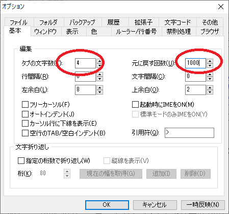

次に上の沢山あるタブの中からウィンドウを選んでください。

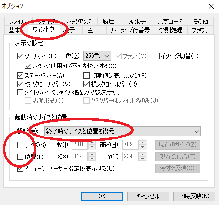

下の機能の灰色のところを「終了時のサイズと位置を復元」に変更、  
下のサイズと位置のチェックを外してください。

終わったら上のタブの表示をクリックしてください。

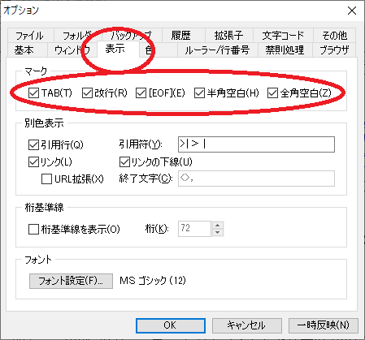

上の1列すべてにチェックを入れてください。

終わったら上のタブの文字コードをクリックしてください。

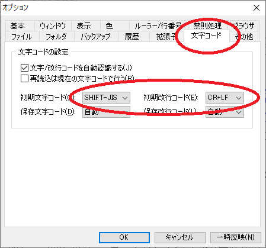

このようになっていると思います。  
初期文字コードのところだけを弄ります。

まず右のCR+LFをLFに変更してください。

次に左の`SHIFT-JIS`を`UTF-8N`に変更してください。

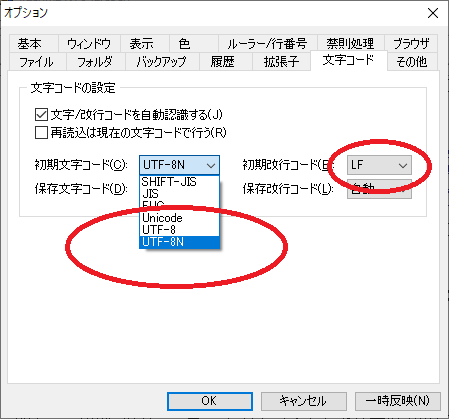

間違いやすいのですが`UTF-8`ではなく`UTF-8N`です。

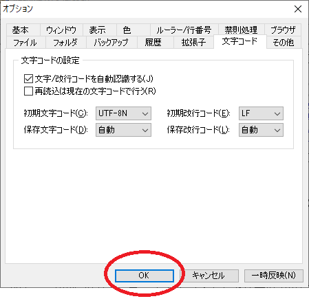

この状態になればOKです。

## Visual Studio Code のインストール

インストールに難しいところはありません。
まず `2.soft/VSCodeSetup-x64-1.45.1.exe` を開きます。

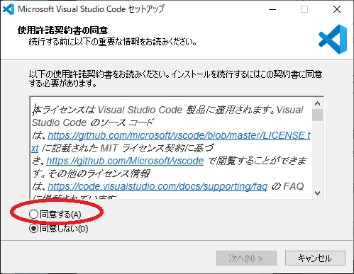

ひらくとこのような画面になりますので、よくあるソフトと同じようにインストールできます。

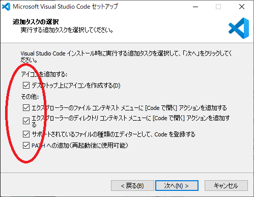

この画面になったらチェックをすべて入れます。  
あとはそのまま進めるとインストールできます。  
インストールが完了するとVisual Studio Codeが起動します。  

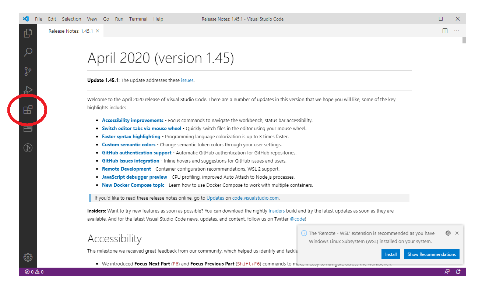

左の赤まるをつけたアイコンをクリックします。

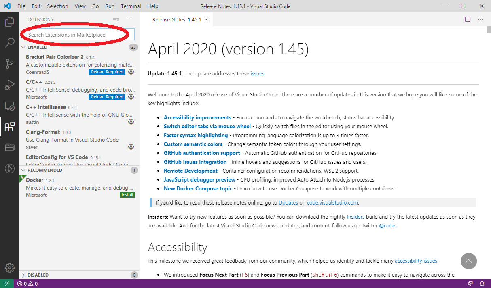

するとこのように左側にメニューが開きます。  
これはVisual Studio Codeに拡張機能を検索、インストールできるメニューです。  
上に検索窓がありますので検索してインストールできます。覚えておきましょう。

http://net2.system.to/pc/font.html
http://net2.system.to/pc/cgi-bin/download.cgi?file=yutapon_coding_081.zip
