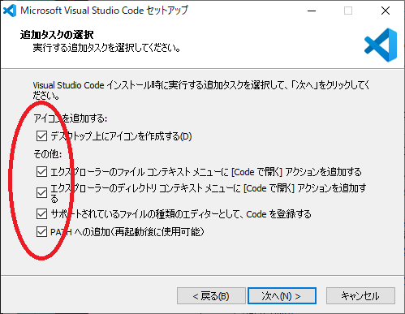

# Visual Studio Code のインストール

次にVisual studio Codeをインストールしていきます。
こちらもインストールに難しいところはありません。

まず `2.soft/VSCodeSetup-x64-1.45.1.exe` を開きます。

ひらくとこのような画面になりますので、よくあるソフトと同じようにインストールできます。

この画面になったらチェックをすべて入れます。  
あとはそのまま進めるとインストールできます。  
インストールが完了するとVisual Studio Codeが起動します。  

左の赤まるをつけたアイコンをクリックします。

するとこのように左側にメニューが開きます。  
これはVisual Studio Codeに拡張機能を検索、インストールできるメニューです。  
上に検索窓がありますので検索してインストールできます。覚えておきましょう。

