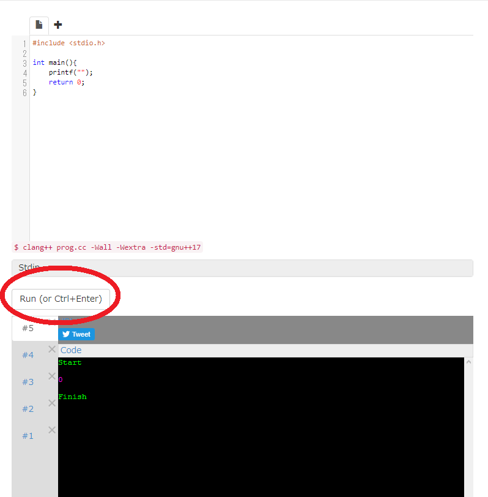
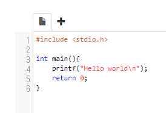
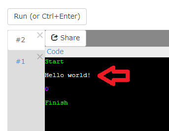

# C言語でハローワールド

それではプログラマーの入学式のハローワールドです。
今からC言語というプログラミング言語でハローワールドを見ていきます。

C言語は昔OS(オペレーティングシステム)を作るために作られたプログラミング言語です。  
OSというのは、WindowsやAndroidのようにパソコンやスマートフォンに入っている重要なプログラムです。
例えばマウスポインタやデスクトップ画面、スマホだと指でスワイプできるホーム画面などを実現しているプログラムです。

C言語は特に家電製品やロボットなどの中のプログラムや、
ハイパフォーマンスが要求される分野でよく使われています。

コンパイルが必要なコンパイル言語という種類の代表的なプログラミング言語です。
コンパイルについては3章で解説しますので、
今はすぐは使えなくてワンクッションいるプログラミング言語なんだなあ、
くらいに思っていてください。

## ハローワールド

このURLを開いてください。  
[https://wandbox.org/permlink/xGzIHxMqkg9ssjJ8](https://wandbox.org/permlink/xGzIHxMqkg9ssjJ8)  
既にプログラムが書かれているページが開きます。  

このサイト[Wandbox](https://wandbox.org)は、  
webブラウザ上でプログラムを動かすことができるwebサイトです。

---

上の部分にプログラムを入力することができます。  

プログラムはこのようになっています。

	#include <stdio.h>
	
	int main(){
		printf("");
		return 0;
	}

---

赤まるのところの`Run (or) Ctrl+Enter)` をクリックすると、  
上に書かれたプログラムが実行されます。  

---

実行すると下の黒い部分に実行結果が表示されます。  
今はそこに

	start
	0
	Finish

と書かれています。

---

ここで、4行目の`printf("");`のダブルクオート`"`で囲まれたところに  
`Hello world!\n` と入力してみましょう。

プログラムはこのようになっています。

	#include <stdio.h>
	
	int main(){
		printf("Hello world!\n");
		return 0;
	}

  
こんな感じです。  

---

それでは`Run (or) Ctrl+Enter)`を押して実行してみましょう。  
正しく入力できていれば下の黒い部分がこのようになります。

	start
	Hello world!
	0
	Finish

さっきと変わり、`Hello world!` と表示されましたか？

もし正しくできなかった場合、  
なにか間違って入力してしまっていたり、  
間違って文字を消してしまっていたりが考えられます。  
正しく実行できなくて、間違っている部分がわからなくても大丈夫です。  
こちらのURLを開けば正しく入力されたプログラムが開けます。

[https://wandbox.org/permlink/TPbCXa7oxdeM8zrb](https://wandbox.org/permlink/TPbCXa7oxdeM8zrb)

---

正しくハローワールドできましたか？  
これであなたは初めてのプログラムを書いて実行することができました!
おめでとうございます\('ω')/  

プログラムの中身の解説が欲しいかもしれませんが、  
それはとりあえず後回しにします。

次へ進みましょう。

