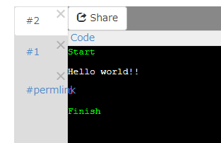
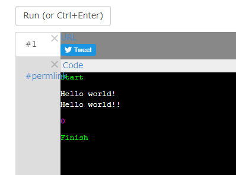

# C++でハローワールド

C言語でハローワールドはできましたか？  
次はC++言語でハローワールドします。

C++言語はC言語を拡張して作られたプログラミング言語で、  
大規模なプログラムが作りやすくなっています。

C言語と同様に、コンパイルが必要なコンパイル言語という種類のプログラミング言語です。  
C++言語はよく「しーぷらぷら」と呼ばれます。

## ハローワールド

このURLを開いてください。  
[https://wandbox.org/permlink/cps6j0HbEnmBBViX](https://wandbox.org/permlink/cps6j0HbEnmBBViX)  
既にプログラムが書かれているページが開きます。  

---

プログラムはこのようになっています。
今回は既にダブルクオートの中に`Hello world!!`と書かれています。

	#include <iostream>

	int main() {
		std::cout << "Hello world!!" << std::endl;
		return 0;
	}

C言語と少し変わっているのがわかりますか？
C言語のハローワールドはこんな感じでした。

	#include <stdio.h>
	
	int main(){
		printf("Hello world!\n");
		return 0;
	}

C言語では`printf("Hello world!\n");`となっていた部分が、  
C++ではでは`std::cout << "Hello world!!" << std::endl;`となっています。

---

それでは実行してみましょう。  
といってもURLを開いた状態で、既に実行された状態になっています\_(:3 」∠ )\_

ちょっと違いをつけるために`!`の数を増やしていますが、  
実行結果はC言語のハローワールドと一緒です。

---

少しいじってみましょう。

	std::cout << "Hello world!!" << std::endl;

の上の行に`printf("Hello world!\n");`
と書いてみましょう。

プログラムはこうなります。

	#include <iostream>

	int main() {
		printf("Hello world!\n");
		std::cout << "Hello world!!" << std::endl;
		return 0;
	}

実行してみましょう。

正しく実行できたでしょうか。  
`!`が1つの行がC言語の`printf("Hello world!\n");`で出力された文字列で、  
`!`が2つの行がC++言語の`std::cout << "Hello world!! << std::endl;"`で出力された文字列です。

正しく実行できなくても気にしないでください。  
正しく実行できるURLを用意しています(/'ω')/
[https://wandbox.org/permlink/xAmO61t4VeNgkffs](https://wandbox.org/permlink/xAmO61t4VeNgkffs)

最初のほうにC++言語はC言語を拡張したものだと書きました。  
C++言語はC言語の拡張なので、C言語のプログラムがある程度そのまま動きます。

それでは次にすすみましょう。

