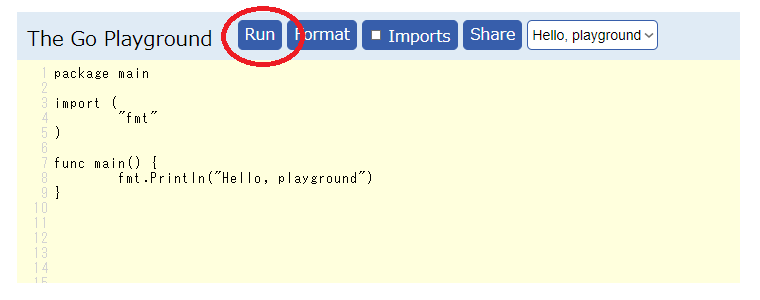

# Go言語でハローワールド

次はGo言語というプログラミング言語でハローワールドします。

Go言語はGoogleがつくった新しい言語です。

C言語は1972年、C++は1985年、Go言語は2009年なのでだいぶ新しいです。

Go言語は検索するときに`go`で検索すると動詞のgoが一致して検索しずらいのもあって、  
普通Golangと呼ばれます。

## ハローワールド

[https://play.golang.org](https://play.golang.org) を開いてください。  

	package main

	import (
		"fmt"
	)

	func main() {
		fmt.Println("Hello, playground")
	}

このページは私が何も準備しなくても、最初から文字列の違うハローワールドが書いてあります。  
上の`Run`をクリックしてみましょう。下に`Hello, playground Program exited.`と表示されます。  

C言語やC++言語となんとなく似ているのがわかるでしょうか。  
プログラミング言語はある程度共通点があることが多いです。  
なので1つ言語を学ぶと新しくほかの言語を学ぶのが早くなります。

