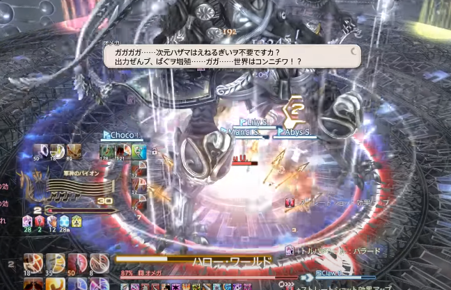
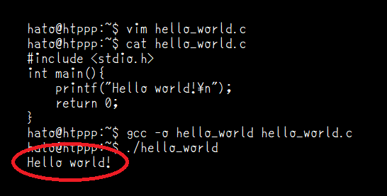

# ハローワールド

それではいよいよプログラムに入っていきます。

日本で小学校に入ったら入学式があるように、  
プログラムの入門の第一歩はハローワールドと決まっています。  
入学式経験したことがないというのはちょっと寂しいですよね。  
私もあなたに寂しい思いをしてほしくありません。  
いわば伝統です。  
わたしもハローワールドしたことあるよという人になってほしいのです。  
世界中のプログラマーは皆ハローワールドをやってプログラマーになっていきます。  
次はあなたの番です。

## そもそもハローワールドとは

FF14の民にはハロワでおなじみハローワールド。

これのことです。  
&nbsp;  
&nbsp;  
&nbsp;  
正確にはこれの元ネタです。

ハローワールドはプログラム入門者にプログラムの例を出す際最初に書かれる、  
実行するとただ`Hello world!`と表示されるプログラムのことです。  

実際にはこのようになります。

今は一番下の部分に`Hello world!`と書いてあることだけ見ておいてください。  
ただこれをパソコンに表示させる、それだけのプログラムがハローワールドです。

たったこれだけですが、これを実際にやるにはいくつか課題があります。

例えば正しくプログラムを入力しなければなりません。
プログラムは入門者には呪文にしか見えないでしょう。
呪文を１文字も間違えずに正しく入力するのはそれなりに難しいことです。
変なところに余分な文字が入っていてはいけないのですが、
プログラムが呪文に見える入門者にとってそもそも全てが変なところなので、  
どこが余分な文字が入っていてはいけない変なところなのかわかりません。

それでは実際にやっていきましょう。

