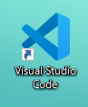
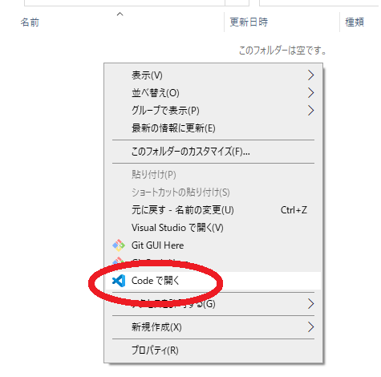
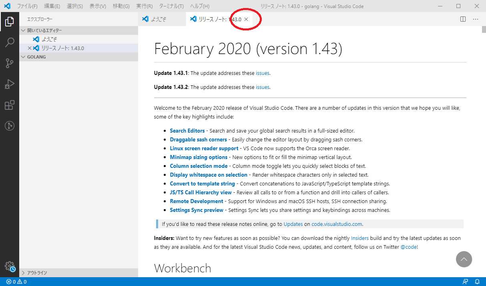
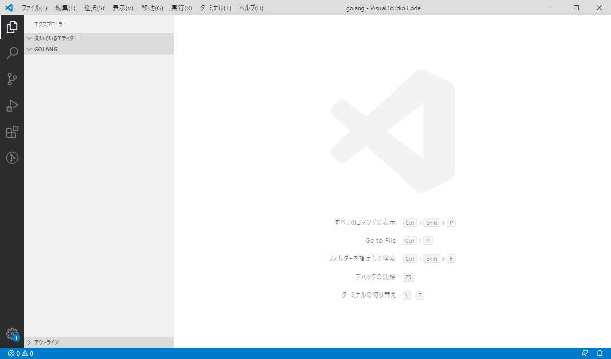
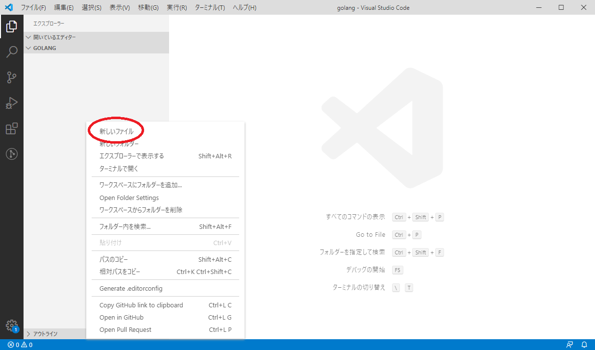
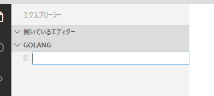
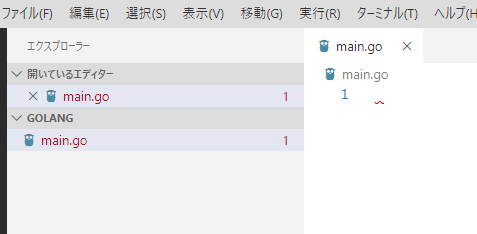
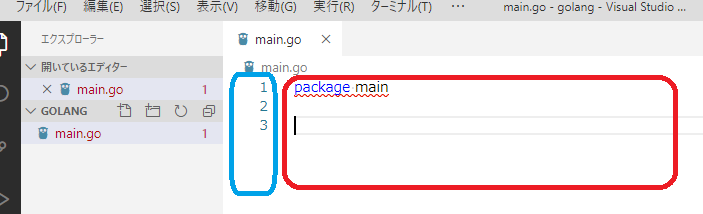
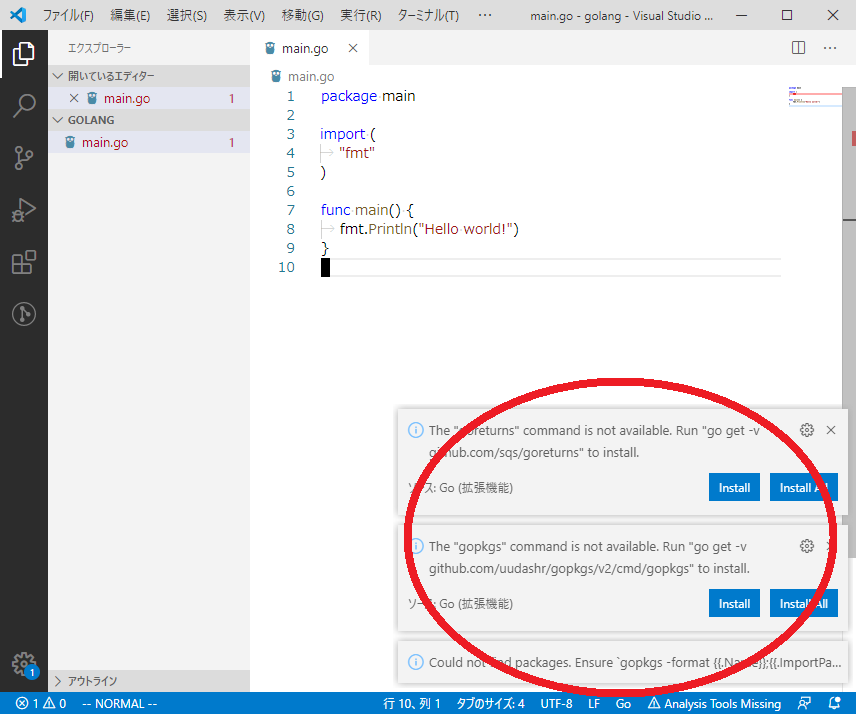

# コンパイルをしてみよう

さていよいよコンパイルです。
ここまでコンパイルについて何も説明なく進めてきました。
このページの中でコンパイルについて説明します。

## 初めてのコンパイル

それではテキストエディタを開きます。

1章でインストールが終わっていれば、  
デスクトップに`Visual Studio Code` というアイコンがあるはずです。  

このマークが`Visual Studio Code`のアイコンです。

これをクリックしてもいいのですが、
先に今からプログラムを書いていく場所を作りましょう。

## 1. 保存場所を作る

どこでもいいのですが、とりあえずデスクトップに1つフォルダを作りましょう。  
フォルダ名は`3.local`にしましょう。  
そして新しく作ったフォルダの中に更に2つフォルダを作りましょう。  
フォルダの名前は`golang`と`python`にします。  

このようになります。

	Desktop/3.local/
	├── golang
	└── python

## 2. テキストエディタを開く

新しく作った`3.local/golang`を開いてください。
そしてフォルダ内の何もないところを右クリックしてください。

出たメニューに`Codeで開く`というのがありますね。
これをクリックしてください。
こうすると、`Visual Studio Code`でファイルを保存すると勝手にこのフォルダに保存されます。

開くとリリースノートというのが出ますが、特に関係ないので上の×を押して閉じましょう。  
ようこそというのもありますが、いらないので閉じましょう。

この画面になったら私と同じ状態です。  

## 3. 新しいテキストファイルを作る

左側の灰色の部分の上のほうに`開いているエディター`と`GOLANG`と書かれています。  
`開いているエディター`は現在`Visual Studio Code`で開いているファイルの一覧が表示されます。  
今は何も開いていないので何も書かれていません。  

`GOLANG`は先ほど新しく作ったフォルダで、右クリックをして`Visual Studio Code`を開いたため、  
`3.local/golang` のフォルダを`Visual Studio Code`が開いていますよということです。

次に左側の灰色の開いている部分を右クリックします。  

上にある新しいファイルをクリックしましょう。

すると何やら入力できそうな欄が出るので、ここに`main.go`と入力しましょう。  
そうするとこのようになります。

この状態で先ほど `2. テキストエディタを開く` で`Visual Studio Code`を開いたフォルダを見てみましょう。  
`3.local/golang`に新しく`main.go`ができていると思います。

もし名前を間違ってしまっても気にしないでください。  
今作ったテキストファイルを右クリックして、メニュー中に名前の変更というのがありますので、簡単に変更できます。

## 4. 写経

いよいよプログラムを書いてを0から書いていきます。  
右側の白い部分に文字を書けます。

図の赤い部分にテキストを入力します。  
ここでは`package main`と書いて改行しています。  

図の青い部分は行番号です。2つ改行しているので3まで表示されていますね。  
ここまで書けましたか？ ここまで1文字一句間違えてはいけません。  
どんどん書いていきましょう。  

	package main

	import (
		"fmt"
	)

	func main() {
		fmt.Println("Hello world!")
	}

これを入力しましょう。  
これはコピペはやめましょう。  
なぜかというと、1文字一句正しく入力することもプログラマーとして必要な能力だからです。
このように教材をひたすら正しく入力することをプログラマー界隈では写経といいます。

ここまで書いている間に右下にバーナーが邪魔してくると思います。

とりあえず今は無視するか、右上の×を押して閉じましょう。  

5. 
さてここで正しく入力できましたか？  
これはプログラムのソースコードと呼ばれます。  
それではいよいよローカルで

さてここで正しく入力できたとして、このままではハローワールドできません。

Webブラウザの時はボタンを押せば実行できたのですが、  
それはいろいろWebサイトが良しなにやってくれていたので実行できたのです。

