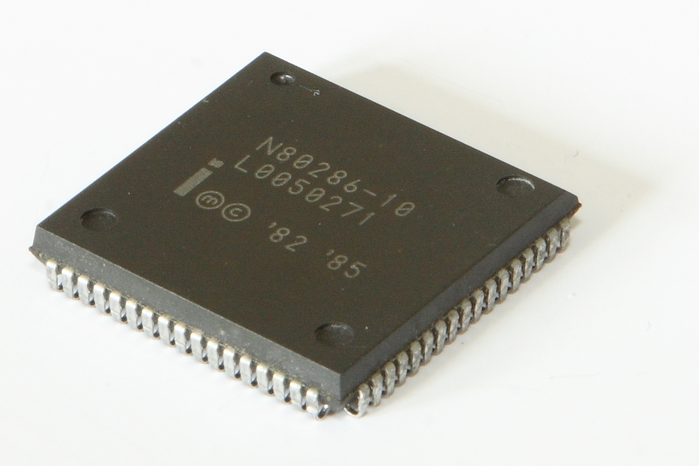

# CPUについて

じゃあコンピューターがわかる言葉ってどんなものでしょうか。  
先ほどからコンピューター、コンピューターといっているものは正確にはCPUというものです。  
コンピューターとはCPUとそのCPUをサポートする仲間たちの集まりなのです。  
CPUさんがトップでブレインなので、コンピューターにお願いするということは、  
CPUさんにお願いすることなのです。  

## CPUの見た目

ではCPUとはどんなものなのか。  
百聞は一見に如かずというもので、米国Intel社のCPUの画像を歴史順に雑にペタペタ張っておきます。  

---

  
1971年のIntel 4004という物です。CPUの画像といいながらCPUというにはまだ機能が少なく、  
マイクロプロセッサ、MPU(Micro Processing Unit)と呼ばれます。  
日本の電卓メーカーから安い電卓作りたいんだけどという話を受けて、そのころまだ小さかった米国Intel社が作りました。  
足が片方8本全部で16本生えています。  

---

  
1974年のIntel 8080という物です。これも足が16本生えています。  

---

  
1978年のIntel 8086というものです。これは足が増えて40本生えています。  

---

  
1982年のIntel 80286というものです。更に足が増えて68本生えています。  

---

  
1985年のIntel 80386というものです。  
今まで足が側面についていたのが、側面に収まりきらず裏面に移動しました。  
足は132本生えています。  

---

  
だいぶ先に進めて1999年のPentium IIIというCPUです。  
足は370本になりました。  

---

  
更に進めて2008年のcore i7 940というCPUです。足の数は1366本です。  
このころになるともうCPUは足というよりただの小さな金属の板が並ぶようになりました。  
こういうのをランドといいます。覚えなくていいです。  

CPUは基板(Mother board)という板にくっ付けられるのですが、  
基板との接続のために、従来は基板側に凹み、CPU側に足が生えていました。  
この辺の時代からそれが逆になってCPUの足が基板側に移動しました。  

  

こんなふうに千本以上の足が基板に生えるようになりました。

## CPUの足

CPUの雰囲気が伝わりましたか？  
雑に足が生えていることがわかってもらえれば十分です。  
この足は信号線と呼ばれるものです。  

## CPUがわかる言葉とは

CPUには足が生えていますが、もっというと足しか生えてません。  
目とか耳はついていないのです。当然日本語をそのまま理解することはできないのです。  

じゃあどうやってCPUに予定表を理解してもらうかというと、  
足しか生えてないので足を使うしかないのです。  

CPUとお喋りするために、いっぱいあるCPUの足に電気を流してお喋りします。  
これは既に、この足に電気を流して、この足には電気を流さないときはCPUはこういう意味だと理解するよ、とあらかじめIntelのおじさんが決めているのです。  

なので予定表をどの足に電気を流したり流さなかったりするかのリストに書き換えておいて、  
一つ一つそのリストの通りにCPUに電気を流すことで、予定表に書いてあることをCPUにお願いするのです。  

そうするとCPUさんはようやく、  
あっファイル開いて中身に1足してファイル閉じたらいいのね、やっておいたよ、  
と理解してさっとお仕事してくれるのです。  

## 

