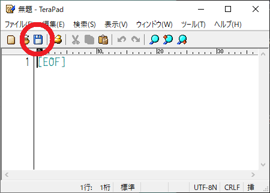
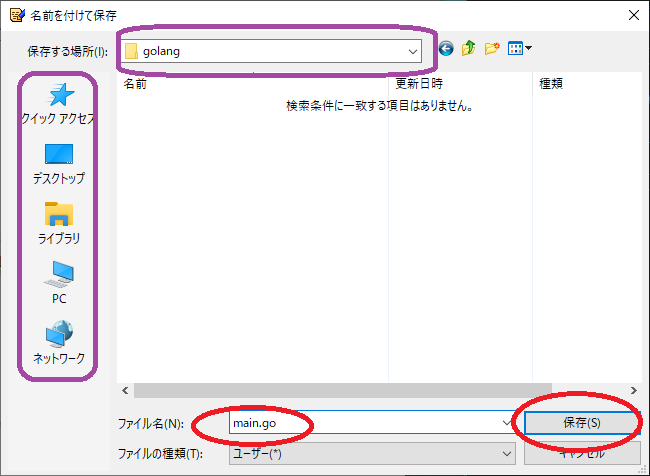
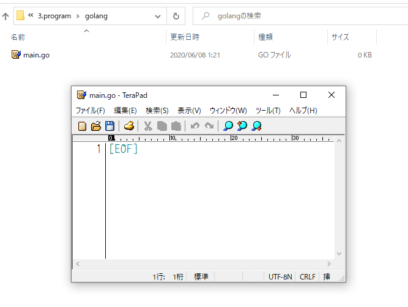
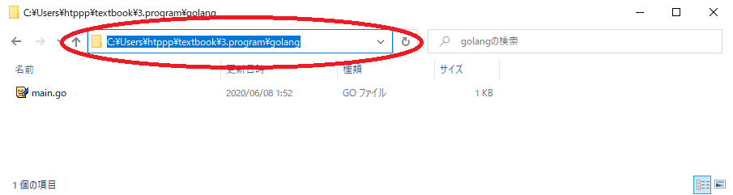
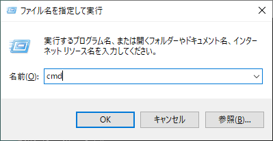
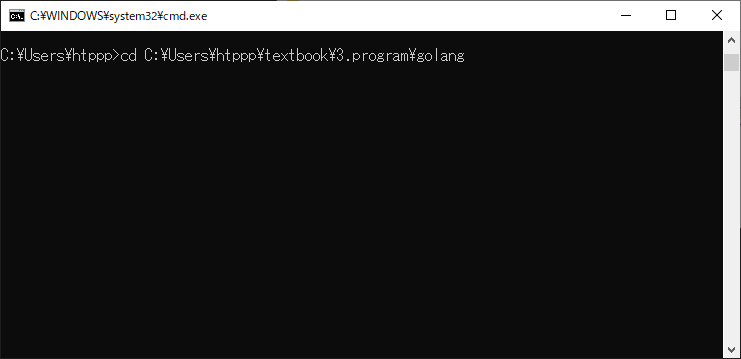
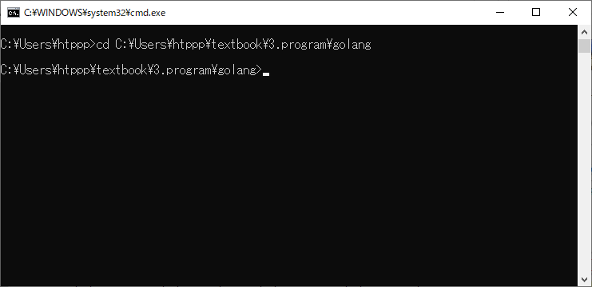
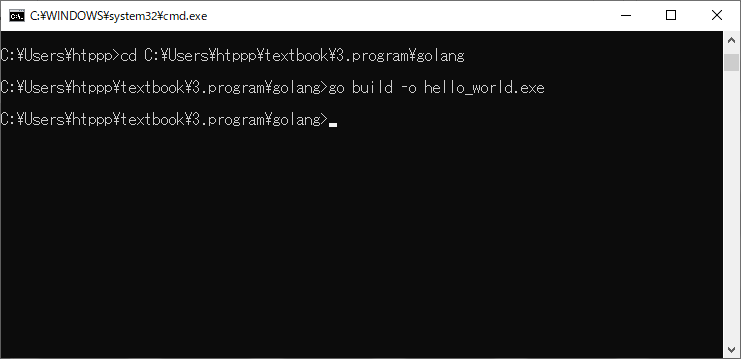
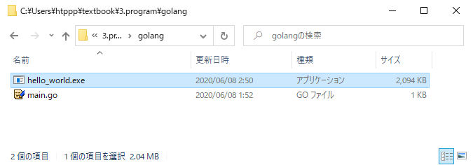
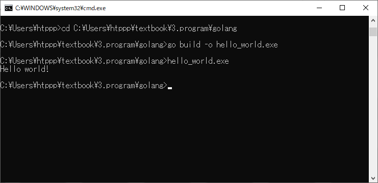

# Terapad でプログラミング

1章でインストールが終わっていれば、  
デスクトップに`Terapad` というアイコンがあるはずです。  

これをクリックしてTerapadを起動しましょう。

## ファイルを保存する

画像の赤まるで囲ったフロッピーディスクのアイコンをクリックすると保存できます。  

一応念のために行っておくとフロッピーディスクというのはこういうものです。

容量は1.44MBです。まあなかなか見る機会はないでしょう。

フロッピーディスクのアイコンをクリックするとこのような画面が出るので
紫のところをポチポチして先ほど作成した`3.program/golang`のフォルダに行きます。

たどり着けたら赤まるのように`main.go`と入力して保存します。

空のファイルが`3.program/golang/main.go`として保存されました。

## コーディング

単にプログラムを書くことをコーディング(coding)といいます。
プログラミング(programing)とほぼ同じ意味ですが、
プログラミングはアルゴリズム等を考える作業も含みます。
コーディングは単に記述することだけを指すことが多いです。

	package main

	import (
		"fmt"
	)

	func main() {
		fmt.Println("Hello world!")
	}

これをTerapadに入力して保存してください。
入力が間違ってなければ`3.program/golang/main.go`にハローワールドのプログラムが保存されました。

初めてなので一応難しい方法をやっておきます。  
これは難しいかもしれないので、一応なぞりつつ、うまくいかなかったらやらなくてもいいです。  
重要なところではないので、つまずいて時間を割いてはもったいないです。  
うまくいかないなあというときは眺めるだけにしておきましょう。  
雰囲気だけ見ていてください。  

あくまで今からやるのは難しい方法なので、その後簡単な方法を書きます。

## コンパイル

### 1. 場所を知る

まず`3.program/golang/`がどこにあるのかを知りたいです。
今までエクスプローラーで開いていたフォルダの上部分のアドレスバーをクリックしてください。

クリックすると選択状態になると思います。この状態で`Ctrl+C`を押してコピーしてください。

コピーできましたか？
私の場合`C:\Users\htppp\textbook\3.program\golang`でした。

### 2. コマンドプロンプトを立ち上げる

次に、コマンドプロンプトというのを起動します。  
おもむろにwindowsキーとRを同時押ししてください。  
そして出たウィンドウに`cmd`と入力してください。

入力してエンターを押すと黒い画面が出ます。  
この黒い画面はコマンドプロンプトと呼ばれます。覚えてください。

この画面を簡単に解説します。

	C:\Users\htppp>

コマンドプロンプトにはこのように出ています。  
`C:\Users\htppp>`の最後に`>`があります。これはプロンプトと言います。  
プロンプトはパソコンが今あなたの入力を待っていますよということを表しています。  
つまりパソコンは待機していることを表しています。  
プロンプトの前の文字列`C:\Users\htppp`は今いる場所を表しています。  
つまり`C:\Users\htppp>`は、今`C:\Users\htppp`にいて、あなたの入力を待っていますよ、という意味になります。

### 3. 場所を移動する

この状態で`cd`と入力し、その後1つ半角空白を入れます。  
その後黒い画面を右クリックしてください。

このような感じになりましたか？  

コマンドプロンプトで右クリックは貼り付けを意味するので、  
先ほどコピーした`3.program/golang/`のフォルダの場所が貼り付けられました。  
これで`cd 場所`のようになったはずです。

`cd` というのはchange directoryの略でdirectoryはフォルダのことです。  
`cd 場所` は、そこに行きたいよという意味になります。

私の場合`cd C:\Users\htppp\textbook\3.program\golang`となりました。  
これでパソコンに`C:\Users\htppp\textbook\3.program\golang`に行きたいよと伝えることができます。

この状態でEnterを押しましょう。

こんなふうになりました。  
プロンプトの前が`C:\Users\htppp\textbook\3.program\golang`となってますね。
プロンプトの前は現在の位置を表しているので、正しく移動できたことがわかります。

### 4. コンパイル

ここでようやくコンパイルします。  

この状態で`go build -o hello_world.exe`と入力してEnterを押すと、

こうなりました。  
この時、元のフォルダを見てみると、`main.go` のほかに`hello_world.exe`ができています。  

このexeファイルが実行ファイルです。  
先ほど書いた`main.go`がコンパイルされて`hello_world.exe`ができたのです。

### 5. 実行

一応クリックしても何も起きません。

コマンドプロンプトに戻り、`hello_world.exe`と入力してエンターを押します。

するとこのように表示されました。

	C:\Users\htppp>cd C:\Users\htppp\textbook\3.program\golang

	C:\Users\htppp\textbook\3.program\golang>go build -o hello_world.exe

	C:\Users\htppp\textbook\3.program\golang>hello_world.exe
	Hello world!

	C:\Users\htppp\textbook\3.program\golang>

見えますでしょうか。  
`hello_world.exe`と入力した次の行に、`Hello world!`と表示されています。  
これでハローワールドが成功しました。\\('ω')/

## 解説

