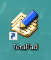

# Terapad でプログラミング

## Terapadを実行

1章でインストールが終わっていれば、  
デスクトップに`Terapad` というアイコンがあるはずです。  

これをクリックしてTerapadを実行しましょう。  

実行というのは、パソコンの電源を入れることを起動というように、プログラムなどをスタートすることを言います。  
プログラムの実行のことも起動ともいうこともありますがこれは一応誤用かもしれませんが、普及しているので問題ないでしょう。

### これは余談です

英語だと起動はboot、実行はrunになるでしょうか。  
プログラミング入門書ではbootという単語の語源について解説するのが定番な感じなので触れておくと、  
bootは、bootstrapから来ており、ブーツ(boots)のつまみ革(strap)から来ています。bootはbootsの単数形ですね。

ブーツのつまみ革というのは、背の高いブーツについている紐状の物で、  
履くときに手で引っ張りやすいようについてる輪っか状の革のことです。  
靴ひもとは別の部分で履いたときふくらはぎ付近になる位置についています。  

このbootstrapですが、英語に`pull oneself up by one's own bootstraps`(自分の靴のつまみ革を引っ張って自分を引っ張り上げる)という慣用句があります。  
だいたい、「川に落ちちゃったけど自分でつまみ革引っ張って水から上がったよ」くらいの意味で、嘘をつく、ほらを吹くという意味です。  
水に落ちたとき水の中で自分の靴を引っ張り上げて自分で水から脱出する、のは無理だからですね。  
このことからブーツのつまみ革bootstrapは、自分でやり遂げるという意味を持つようになりました。  

プログラムというのは誰かから呼ばれないと動きません。  
テキストエディタもあなたがマウスでクリックしたら起動したのです。  
しかし、マウスでクリックする機能もプログラムであり、だれかから呼ばれないとマウスの機能は使えていないのです。  
そうやって遡っていくと、じゃあ一番最初に動いているプログラムは誰から呼ばれたのか、という問題が出てきます。  
プログラムは呼ばれないと動かないけども、じゃあ呼ぶプログラムはどう動かすのかということです。  

この問題を解決するために、パソコンには特殊なプログラムが入っており、  
パソコンの電源ボタンが押されたら、自分で自分を起動するプログラムが動くようになっています。  
いわばプログラムのつまみ革なので、この特殊なプログラムをbootstapと呼びます。  
小さなプログラムなのですが自分を自分で起動して、そのあと自分より大きなプログラムを呼びます。  
呼ばれたプログラムは更に沢山のプログラムを雪崩式に呼んでいくのです。

