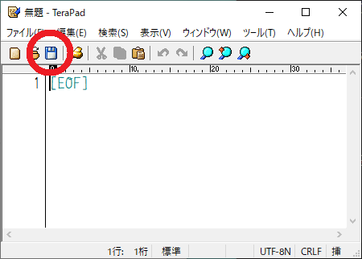
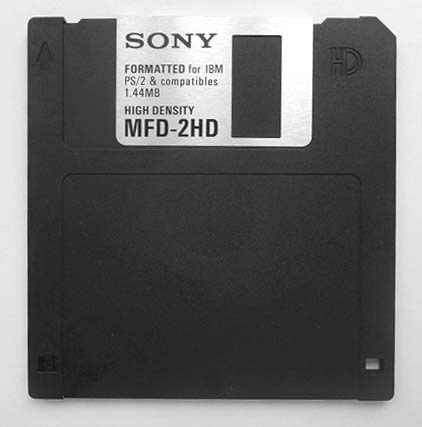
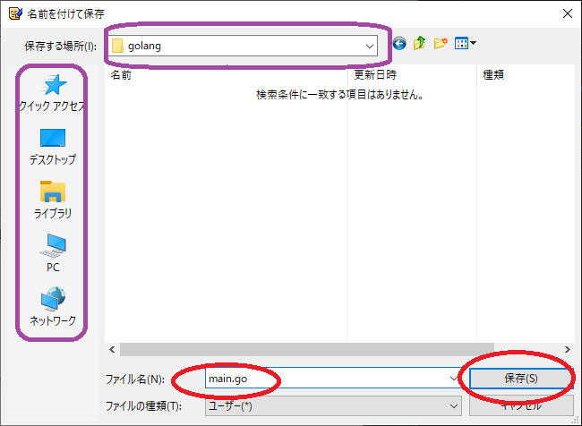
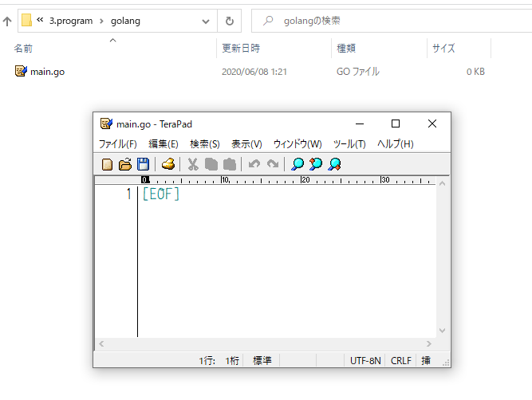

# Terapad でプログラミング

## ファイルを保存する

画像の赤まるで囲ったフロッピーディスクのアイコンをクリックすると保存できます。  

一応念のために行っておくとフロッピーディスクというのはこういうものです。

容量は1.44MBです。まあなかなか見る機会はないでしょう。

フロッピーディスクのアイコンをクリックするとこのような画面が出るので
紫のところをポチポチして先ほど作成した`3.program/golang`のフォルダに行きます。

たどり着けたら赤まるのように`main.go`と入力して保存します。

空のファイルが`3.program/golang/main.go`として保存されました。  
先ほど新しく作ったフォルダの`3.program/golang`をエクスプローラーで見てみましょう。`main.go`ができているでしょうか。

