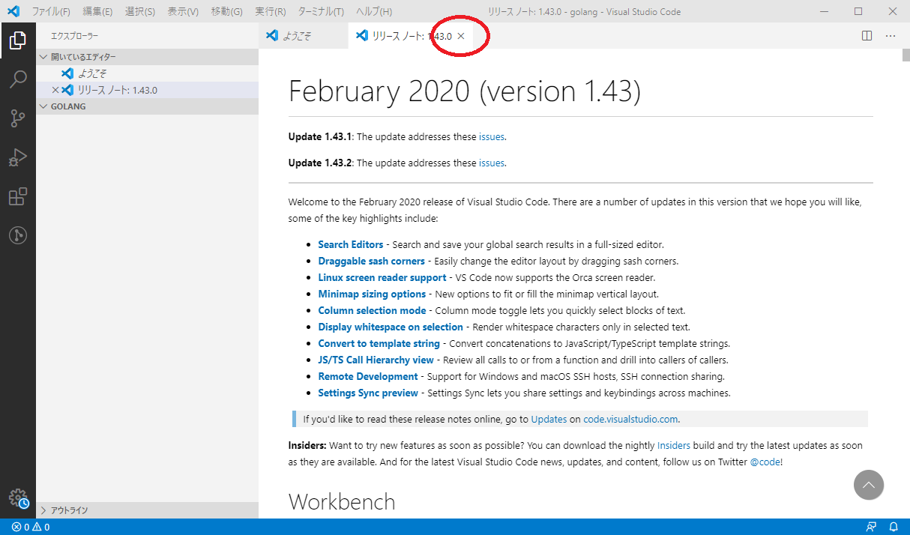
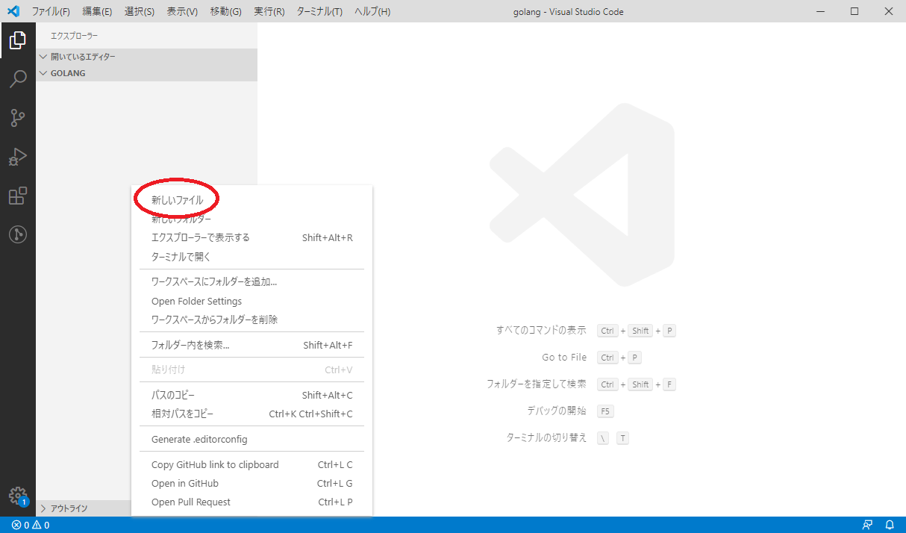
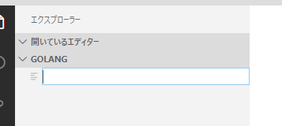

# Visual Studio Code でプログラミング

1章でインストールが終わっていれば、  
デスクトップに`Visual Studio Code` というアイコンがあるはずです。  

このマークが`Visual Studio Code`のアイコンです。

## テキストエディタを開く

`3.program/golang`を開いてください。
そしてフォルダ内の何もないところを右クリックしてください。

出たメニューに`Codeで開く`というのがありますね。
これをクリックしてください。
こうすると、`Visual Studio Code`でファイルを保存すると勝手にこのフォルダに保存されます。

開くとリリースノートというのが出ますが、特に関係ないので上の×を押して閉じましょう。  
ようこそというのもありますが、いらないので閉じましょう。

この画面になったら私と同じ状態です。  

## 新しいテキストファイルを作る

左側の灰色の部分の上のほうに`開いているエディター`と`GOLANG`と書かれています。  
`開いているエディター`は現在`Visual Studio Code`で開いているファイルの一覧が表示されます。  
今は何も開いていないので何も書かれていません。  

`GOLANG`は先ほど新しく作ったフォルダで、右クリックをして`Visual Studio Code`を開いたため、  
`3.program/golang` のフォルダを`Visual Studio Code`が開いていますよということです。

次に左側の灰色の開いている部分を右クリックします。  

上にある新しいファイルをクリックしましょう。

すると何やら入力できそうな欄が出るので、ここに`main.go`と入力しましょう。  
そうするとこのようになります。

この状態で先ほど `2. テキストエディタを開く` で`Visual Studio Code`を開いたフォルダを見てみましょう。  
`3.program/golang`に新しく`main.go`ができていると思います。

もし名前を間違ってしまっても気にしないでください。  
今作ったテキストファイルを右クリックして、メニュー中に名前の変更というのがありますので、簡単に変更できます。

## 写経

いよいよプログラムを書いてを0から書いていきます。  
右側の白い部分に文字を書けます。

図の赤い部分にテキストを入力します。  
ここでは`package main`と書いて改行しています。  

図の青い部分は行番号です。2つ改行しているので3まで表示されていますね。  
ここまで書けましたか？ ここまで1文字一句間違えてはいけません。  
どんどん書いていきましょう。  

	package main

	import (
		"fmt"
	)

	func main() {
		fmt.Println("Hello world!")
	}

これを入力しましょう。  
これはコピペはやめましょう。  
なぜかというと、1文字一句正しく入力することもプログラマーとして必要な能力だからです。  
このように教材をひたすら正しく入力することをプログラマー界隈では写経(しゃきょう)といいます。
プログラマーは写経を通してその言語の書式を学びます。

[フォント](../1/install_font.md)のページを読んだあなたは聞いたことがあると思いますが、  
プログラムにおいて空白は水平タブか半角空白のみを使ってください。  
つまり、キーボードの半角全角キーの下にあるTabキーを使うか半角入力にした状態でスペースキーを押して空白を入力してください。

ここまで書いている間に右下にバーナーが邪魔してくると思います。

とりあえず今は無視するか、右上の×を押して閉じましょう。  

すべて入力で来たら保存します。  
保存は`Ctrl+S`でできます。  
`Ctrl+S`というのはキーボードのControlキーとSのキーを同時に押すことを意味します。  
マウスでも上のファイルから保存できます。  

# コンパイラを使ってみる
さてここで正しく入力できましたか？  
これはプログラムのソースコードと呼ばれます。  
それではいよいよコンパイラを使います。

