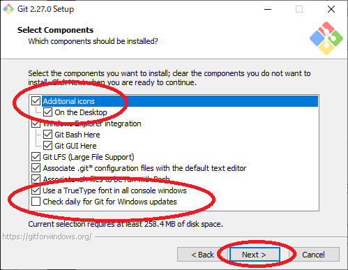
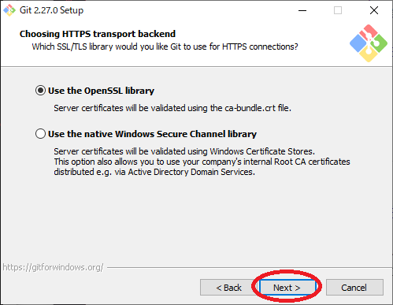
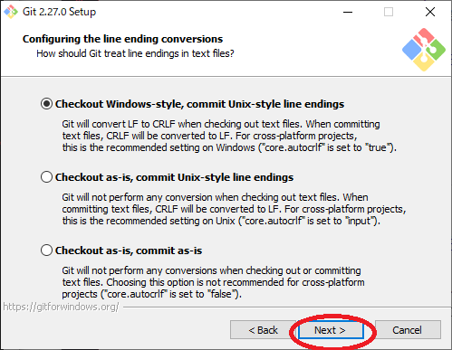
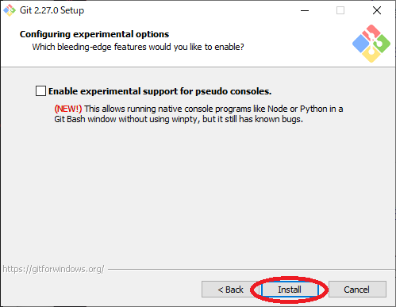

# テキスト

プログラムを作って遊べるようになるのを目標に書いてみました。  
丁寧に書いているので、わからないというより、まわりくどくかんじるかもしれません\_(:3 」∠ )\_

まず最初に２つ、7zipとGitをインストールしてもらいたいです。  

## 7zip
`2.soft`フォルダの中に`7z1900-x64.exe`があるのでこれを開いて`Install`をクリックします。  
これで7zipのインストールは終わりです。

## Git
次に`2.soft`フォルダに2.soft.7z.001というファイルがあります。  

001がついていない場合はwindowsの設定で拡張子というのが非表示になっているので、  
これを表示する状態にする必要があります。  
とりあえずこのサイト [https://paso-kake.com/it/windows10/3103/](https://paso-kake.com/it/windows10/3103/)を見て設定してみてください。  
設定できない場合`show_extension.bat`というものを置いているのでこれをクリックして実行してください。  
実行後に再起動が必要ですがこれで拡張子が表示されるはずです。  

拡張子が表示される状態で001~008までファイルがあるのがわかると思います。  
001のファイルを右クリックして、出たメニューの中から7Zipにカーソルを合わせます。  
カーソルを合わせるとさらにメニューが出るのでその中のここに展開を選びます。  
これで
* Git-2.27.0-64-bit.exe
* go1.14.4.windows-amd64.msi
* python-3.8.3-amd64.exe
* VSCodeSetup-x64-1.45.1.exe
の４つのファイルが展開されます。

この中の`Git-2.27.0-64-bit.exe`を開いてください。
開けたら以下の画像の通りに進めていってください。

  
  
  

ここの赤まるで囲った部分を画像に合わせてください。
  
  
  
  
  
  
  
  

  
ここのEnable symbolic linksにチェックつけてください。

  

以上でGitのインストールが終わりました。
